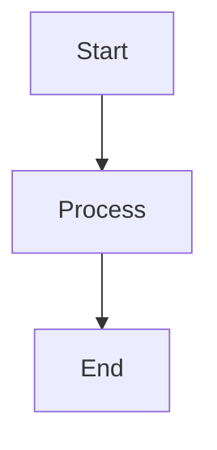

# Test Document

This is a **test** document with some features:

## Code Example
```python
def hello():
    print("Hello, World!")
```

## Mermaid Example


```mermaid
graph TD
    A[Start] --> B[Process]
    B --> C[End]
```

## Math Example

$$ f(x) = x^2 + 2 $$